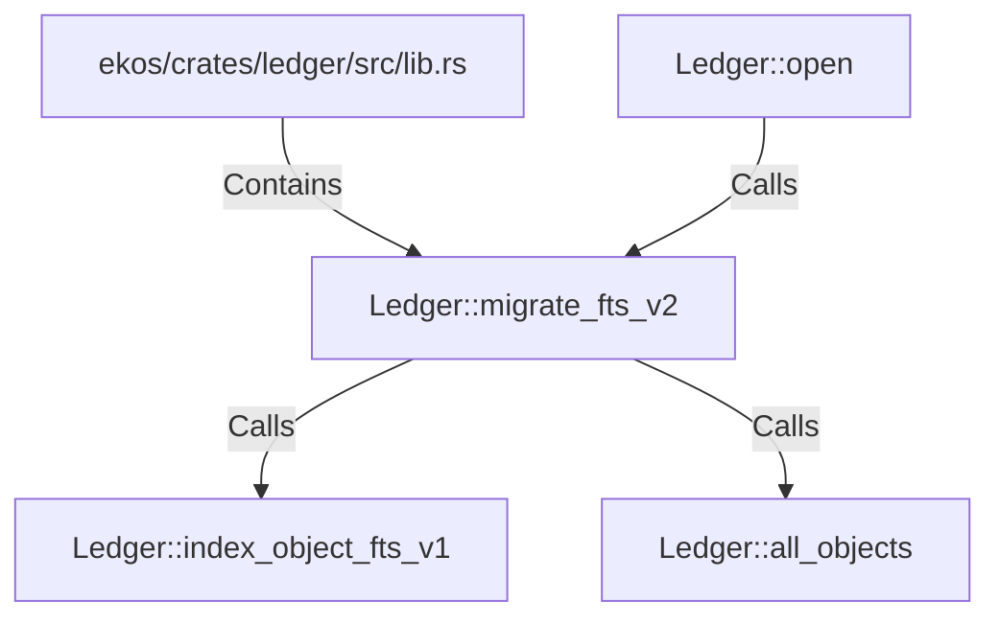

# Ledger::migrate_fts_v2 (RustSymbol)

## Properties

| Key | Value |
|---|---|
| `kind` | method |

## Relationships

### Calls

- ← Ledger::open (`1202f2b1-c8ed-5a89-aac3-5ef29891cb8b`)
- → Ledger::index_object_fts_v1 (`e17ebc72-482b-55d0-8cb3-d68e31347276`)
- → Ledger::all_objects (`d640b0e7-cfd1-5693-8c96-022d84598df3`)

### Contains

- ← ekos/crates/ledger/src/lib.rs (`21938f45-b767-5933-9e71-12e15ff53eb1`)

## Diagram

## Evidence

_No evidence cited._
