# Ledger::payload_to_string (RustSymbol)

## Properties

| Key | Value |
|---|---|
| `kind` | method |

## Relationships

### Calls

- → Codec::decompress (`3ee6589f-f3ba-5e67-b7b6-8950c0575ae5`)
- ← Ledger::query_payloads (`b8401b6d-6d8d-5633-9b6a-27c093ab2db6`)
- ← Ledger::get_object (`bc4b77e9-6e8d-54b0-aa9a-8fc066a535b3`)
- ← Ledger::get_evidence (`68cde231-8d3f-56c2-8009-cf34a2cbc0ca`)
- ← Ledger::get_event (`c392140e-fc05-504a-9c09-97c5662f16fe`)
- ← Ledger::get_relationship (`c9bf9448-5b90-56cb-b8bb-9a80138af70e`)
- ← Ledger::object_at (`619195b7-13c5-595b-9576-105aed9fa7d7`)
- ← migrate_to_v2 (`fee5c44c-a2e1-59db-bf5d-b63aff20f8c9`)
- ← Ledger::all_objects_with_rowids (`f2714bfa-a29a-5e5c-b6ce-96c95bd2a1af`)
- ← payload_samples (`3f1868b5-8442-5a4e-bd91-87c8a3ada3f3`)
- ← Ledger::export_versions (`1ed3c4b0-eefc-5cee-8f3b-f559c0e5f97e`)

### Contains

- ← ekos/crates/ledger/src/lib.rs (`21938f45-b767-5933-9e71-12e15ff53eb1`)

## Diagram

```mermaid
graph TD
    nb30e2764552e5d3ea1e534c523dd7475["Ledger::payload_to_string"]
    n21938f45b76759339e7112e15ff53eb1["ekos/crates/ledger/src/lib.rs"]
    n21938f45b76759339e7112e15ff53eb1 -->|Contains| nb30e2764552e5d3ea1e534c523dd7475
    n3ee6589ff3ba5e67b7b68950c0575ae5["Codec::decompress"]
    nb30e2764552e5d3ea1e534c523dd7475 -->|Calls| n3ee6589ff3ba5e67b7b68950c0575ae5
    nb8401b6d6d8d56339b6a27c093ab2db6["Ledger::query_payloads"]
    nb8401b6d6d8d56339b6a27c093ab2db6 -->|Calls| nb30e2764552e5d3ea1e534c523dd7475
    nbc4b77e96e8d54b0aa9a8fc066a535b3["Ledger::get_object"]
    nbc4b77e96e8d54b0aa9a8fc066a535b3 -->|Calls| nb30e2764552e5d3ea1e534c523dd7475
    n68cde2318d3f56c28009cf34a2cbc0ca["Ledger::get_evidence"]
    n68cde2318d3f56c28009cf34a2cbc0ca -->|Calls| nb30e2764552e5d3ea1e534c523dd7475
    nc392140efc05504a9c0997c5662f16fe["Ledger::get_event"]
    nc392140efc05504a9c0997c5662f16fe -->|Calls| nb30e2764552e5d3ea1e534c523dd7475
    nc9bf94485b9056cbb8bb9a80138af70e["Ledger::get_relationship"]
    nc9bf94485b9056cbb8bb9a80138af70e -->|Calls| nb30e2764552e5d3ea1e534c523dd7475
    n619195b713c5595b9576105aed9fa7d7["Ledger::object_at"]
    n619195b713c5595b9576105aed9fa7d7 -->|Calls| nb30e2764552e5d3ea1e534c523dd7475
    nfee5c44ca2e159dbbf5db63aff20f8c9["migrate_to_v2"]
    nfee5c44ca2e159dbbf5db63aff20f8c9 -->|Calls| nb30e2764552e5d3ea1e534c523dd7475
    nf2714bfaa29a5e5cb6ce96c95bd2a1af["Ledger::all_objects_with_rowids"]
    nf2714bfaa29a5e5cb6ce96c95bd2a1af -->|Calls| nb30e2764552e5d3ea1e534c523dd7475
    n3f1868b584425a4ebd9187c8a3ada3f3["payload_samples"]
    n3f1868b584425a4ebd9187c8a3ada3f3 -->|Calls| nb30e2764552e5d3ea1e534c523dd7475
    n1ed3c4b0eefc5cee8f3bf559c0e5f97e["Ledger::export_versions"]
    n1ed3c4b0eefc5cee8f3bf559c0e5f97e -->|Calls| nb30e2764552e5d3ea1e534c523dd7475
```

## Evidence

_No evidence cited._
