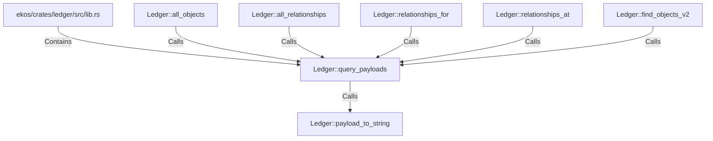

# Ledger::query_payloads (RustSymbol)

## Properties

| Key | Value |
|---|---|
| `kind` | method |

## Relationships

### Calls

- → Ledger::payload_to_string (`b30e2764-552e-5d3e-a1e5-34c523dd7475`)
- ← Ledger::all_objects (`d640b0e7-cfd1-5693-8c96-022d84598df3`)
- ← Ledger::all_relationships (`a4b19ba4-2ef5-50a4-a90e-2107e783f4c8`)
- ← Ledger::relationships_for (`74baa573-62de-586c-993f-6ac506512bfa`)
- ← Ledger::relationships_at (`7703cf42-3d8d-57f5-b3cd-d00b1aa4550c`)
- ← Ledger::find_objects_v2 (`c1f796f9-4eda-5e58-bfc1-90620e984000`)

### Contains

- ← ekos/crates/ledger/src/lib.rs (`21938f45-b767-5933-9e71-12e15ff53eb1`)

## Diagram

## Evidence

_No evidence cited._
