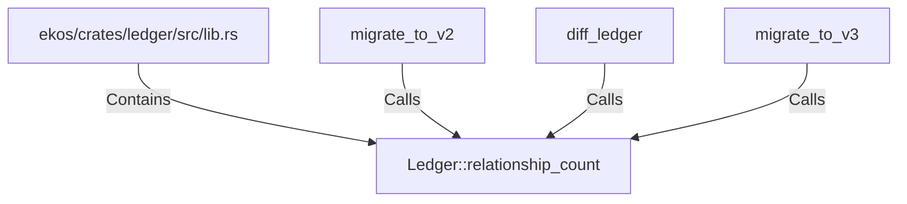

# Ledger::relationship_count (RustSymbol)

## Properties

| Key | Value |
|---|---|
| `kind` | method |

## Relationships

### Calls

- ← migrate_to_v2 (`fee5c44c-a2e1-59db-bf5d-b63aff20f8c9`)
- ← diff_ledger (`efce5b16-7270-58fe-b278-442b178d7df3`)
- ← migrate_to_v3 (`1dab3f65-615b-56e9-ae9b-e92c32a2cb63`)

### Contains

- ← ekos/crates/ledger/src/lib.rs (`21938f45-b767-5933-9e71-12e15ff53eb1`)

## Diagram

## Evidence

_No evidence cited._
