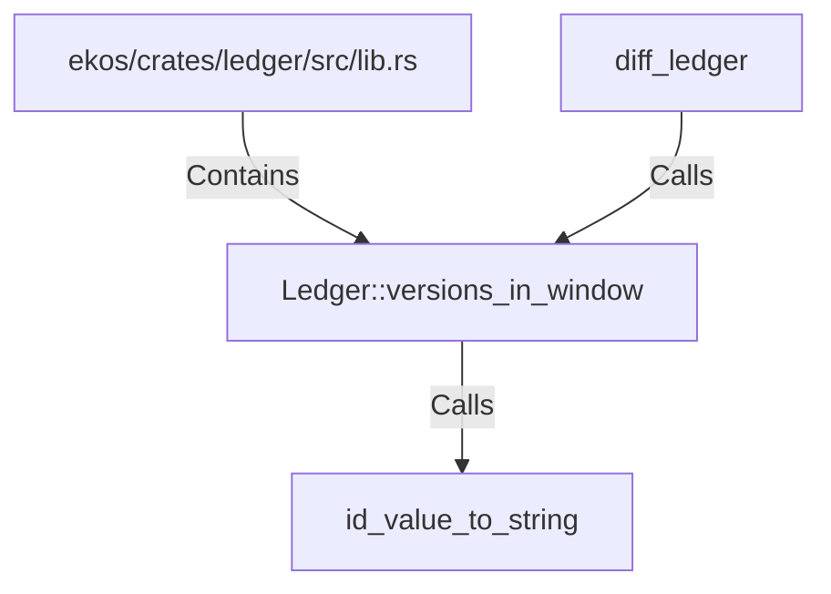

# Ledger::versions_in_window (RustSymbol)

## Properties

| Key | Value |
|---|---|
| `kind` | method |

## Relationships

### Calls

- → id_value_to_string (`a0c3d0ec-3294-5534-a1f2-b2295cc7d77a`)
- ← diff_ledger (`efce5b16-7270-58fe-b278-442b178d7df3`)

### Contains

- ← ekos/crates/ledger/src/lib.rs (`21938f45-b767-5933-9e71-12e15ff53eb1`)

## Diagram

## Evidence

_No evidence cited._
