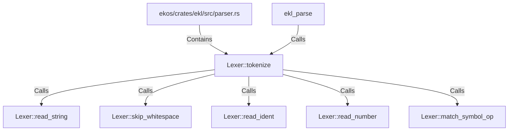

# Lexer::tokenize (RustSymbol)

## Properties

| Key | Value |
|---|---|
| `kind` | method |

## Relationships

### Calls

- → Lexer::read_string (`8ce07f8f-7522-52d3-9c6e-69bb655cf743`)
- → Lexer::skip_whitespace (`3b1864e4-2e2f-5e9c-b6de-22f9d09c4d29`)
- → Lexer::read_ident (`923bdc64-064e-5247-a4bd-f16959f046a3`)
- → Lexer::read_number (`bdbed412-5bba-5cd2-a9f6-af805e8a049f`)
- → Lexer::match_symbol_op (`108c4fe6-d104-55b2-b854-d4e4125c8130`)
- ← ekl_parse (`590311ca-281e-528a-ae35-6f89aceae476`)

### Contains

- ← ekos/crates/ekl/src/parser.rs (`7eda2531-87c8-5048-92b2-c98483606431`)

## Diagram

## Evidence

_No evidence cited._
