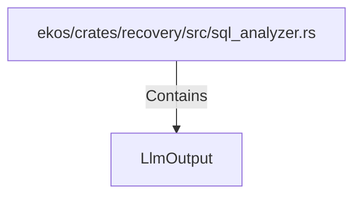

# LlmOutput (RustSymbol)

## Properties

| Key | Value |
|---|---|
| `kind` | struct |

## Relationships

### Contains

- ← ekos/crates/recovery/src/sql_analyzer.rs (`cd768c5e-1640-51c3-b6ec-cb7ac78ade6d`)

## Diagram

## Evidence

_No evidence cited._
