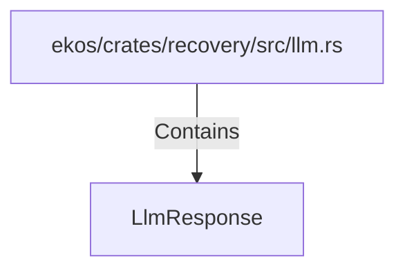

# LlmResponse (RustSymbol)

## Properties

| Key | Value |
|---|---|
| `kind` | struct |

## Relationships

### Contains

- ← ekos/crates/recovery/src/llm.rs (`61d089be-a24a-5745-8bca-67d1d16373ca`)

## Diagram

## Evidence

_No evidence cited._
