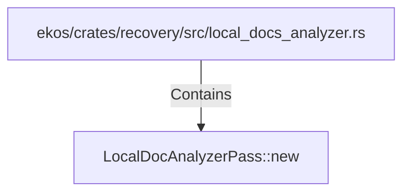

# LocalDocAnalyzerPass::new (RustSymbol)

## Properties

| Key | Value |
|---|---|
| `kind` | method |

## Relationships

### Contains

- ← ekos/crates/recovery/src/local_docs_analyzer.rs (`d4eeb831-bfb8-592d-ad11-0e13adad2090`)

## Diagram

## Evidence

_No evidence cited._
