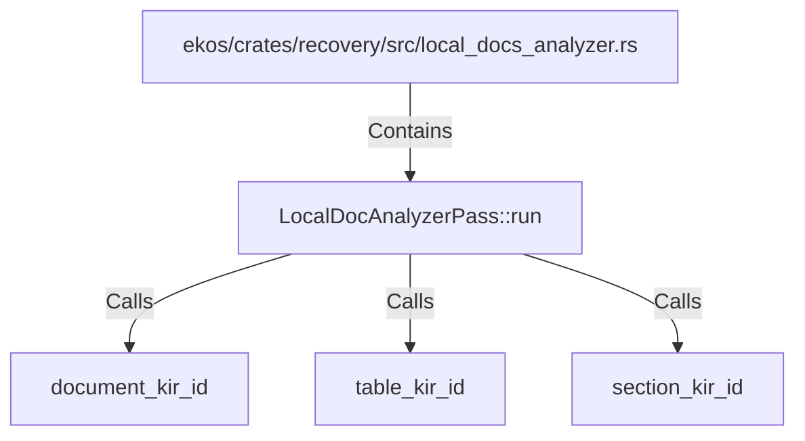

# LocalDocAnalyzerPass::run (RustSymbol)

## Properties

| Key | Value |
|---|---|
| `kind` | method |

## Relationships

### Calls

- → document_kir_id (`f9e9a153-221e-53f1-a9b0-5b9b4bdef2c5`)
- → table_kir_id (`9b204117-7aa0-56cb-99f1-254336e5f1e6`)
- → section_kir_id (`ba226e60-57f3-5450-a94e-6e019dd7ac3a`)

### Contains

- ← ekos/crates/recovery/src/local_docs_analyzer.rs (`d4eeb831-bfb8-592d-ad11-0e13adad2090`)

## Diagram

## Evidence

_No evidence cited._
