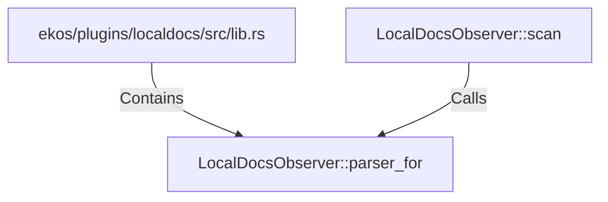

# LocalDocsObserver::parser_for (RustSymbol)

## Properties

| Key | Value |
|---|---|
| `kind` | method |

## Relationships

### Calls

- ← LocalDocsObserver::scan (`b2f17f94-8f65-56aa-9a76-54bfc0554413`)

### Contains

- ← ekos/plugins/localdocs/src/lib.rs (`1ed81bd1-9be1-5cda-9158-9ad4f1980e3d`)

## Diagram

## Evidence

_No evidence cited._
