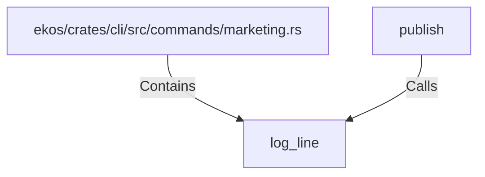

# log_line (RustSymbol)

## Properties

| Key | Value |
|---|---|
| `kind` | function |

## Relationships

### Calls

- ← publish (`e7c2f511-2759-51de-b835-a5aa57064c4f`)

### Contains

- ← ekos/crates/cli/src/commands/marketing.rs (`e4550c2d-5dcf-5779-b25d-ac86e4019342`)

## Diagram

## Evidence

_No evidence cited._
