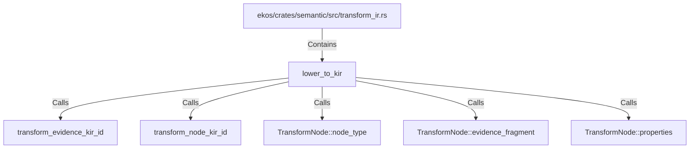

# lower_to_kir (RustSymbol)

## Properties

| Key | Value |
|---|---|
| `kind` | function |

## Relationships

### Calls

- → transform_evidence_kir_id (`acdcb5e6-413e-57b0-bb0b-d519a247e071`)
- → transform_node_kir_id (`3b4e5098-42ef-5a21-894d-ac9ebe86762a`)
- → TransformNode::node_type (`d4c1c00f-b050-5363-b81a-6b984bd7812f`)
- → TransformNode::evidence_fragment (`98f701d7-665e-5625-87e1-27a9028c2efe`)
- → TransformNode::properties (`2e58103d-045e-5409-bf85-e4e0a21186c3`)

### Contains

- ← ekos/crates/semantic/src/transform_ir.rs (`b4fdd24c-8184-5879-9136-f0a70208955e`)

## Diagram

## Evidence

_No evidence cited._
