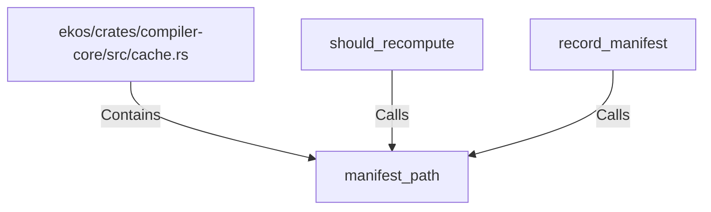

# manifest_path (RustSymbol)

## Properties

| Key | Value |
|---|---|
| `kind` | function |

## Relationships

### Calls

- ← should_recompute (`bc8bc6d9-4904-570c-a032-19abf84603ab`)
- ← record_manifest (`67114ad5-cda0-5d80-9444-0bf9047d0ecc`)

### Contains

- ← ekos/crates/compiler-core/src/cache.rs (`01ec80b2-6c80-5000-979c-acb288ff920a`)

## Diagram

## Evidence

_No evidence cited._
