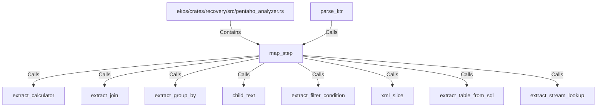

# map_step (RustSymbol)

## Properties

| Key | Value |
|---|---|
| `kind` | function |

## Relationships

### Calls

- ← parse_ktr (`ac857c0a-e7e1-5b8d-972d-dd8184852f15`)
- → extract_calculator (`175b4e7e-b982-5abc-9b19-cef4172fa469`)
- → extract_join (`450b2ac3-e3bb-5b8b-a2d1-ed9e281bc3b2`)
- → extract_group_by (`056c9294-b693-5d0d-84a7-1dca458e5118`)
- → child_text (`f70791ea-bde4-57ab-8af1-ccc69fa9f5a7`)
- → extract_filter_condition (`83af4161-71c8-51b2-8260-b9f08c4e8e42`)
- → xml_slice (`0c5e1b6a-7829-5a6f-a831-e20b9eeb1c27`)
- → extract_table_from_sql (`5f575d34-9287-5ba9-b81a-30f2e77ea92b`)
- → extract_stream_lookup (`2c163fbc-39ec-5e83-82a5-50dcc8f51cfb`)

### Contains

- ← ekos/crates/recovery/src/pentaho_analyzer.rs (`ce3d2f1b-e1c6-55d7-92bc-c1b69f76dbca`)

## Diagram

## Evidence

_No evidence cited._
