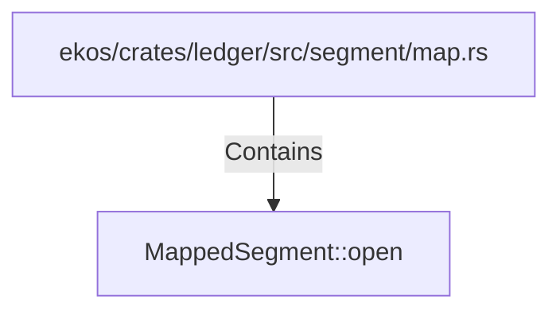

# MappedSegment::open (RustSymbol)

## Properties

| Key | Value |
|---|---|
| `kind` | method |

## Relationships

### Contains

- ← ekos/crates/ledger/src/segment/map.rs (`0f22e130-eb79-55dd-a4c7-20699e32b241`)

## Diagram

## Evidence

_No evidence cited._
