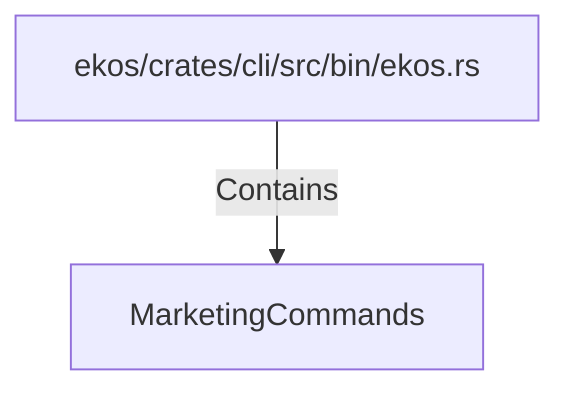

# MarketingCommands (RustSymbol)

## Properties

| Key | Value |
|---|---|
| `kind` | enum |

## Relationships

### Contains

- ← ekos/crates/cli/src/bin/ekos.rs (`67ea4c4e-5e03-5c3a-8066-adf7aaed8a3e`)

## Diagram

## Evidence

_No evidence cited._
