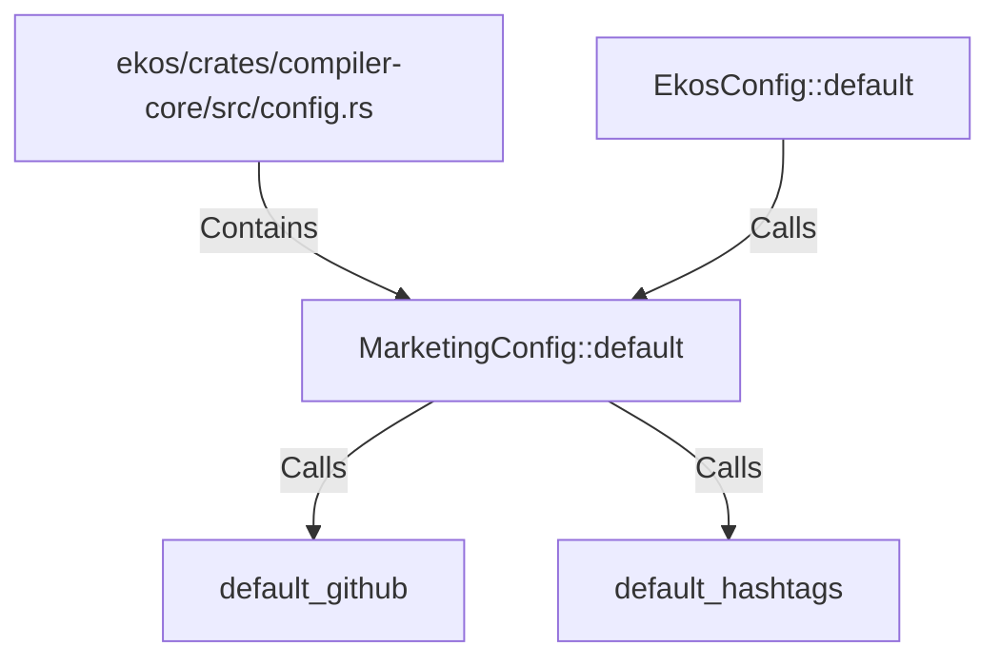

# MarketingConfig::default (RustSymbol)

## Properties

| Key | Value |
|---|---|
| `kind` | method |

## Relationships

### Calls

- → default_github (`81f7cad3-3ade-55cb-a07f-9d2c85cbcc12`)
- → default_hashtags (`88f766d2-9693-5579-8cf3-a2624f967bc2`)
- ← EkosConfig::default (`96f3be94-9761-5db0-b99a-0c705c9c55d0`)

### Contains

- ← ekos/crates/compiler-core/src/config.rs (`d0747f34-25e1-5426-80eb-a54fffcac598`)

## Diagram

## Evidence

_No evidence cited._
