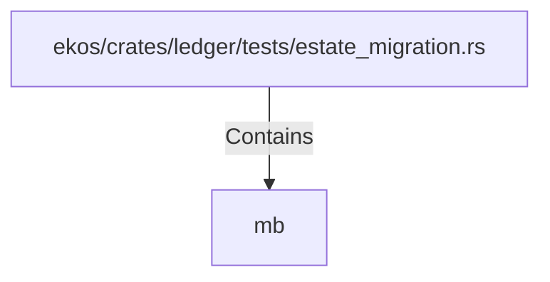

# mb (RustSymbol)

## Properties

| Key | Value |
|---|---|
| `kind` | function |

## Relationships

### Contains

- ← ekos/crates/ledger/tests/estate_migration.rs (`ea07674a-8ab1-54ed-a18a-f016992a8c48`)

## Diagram

## Evidence

_No evidence cited._
