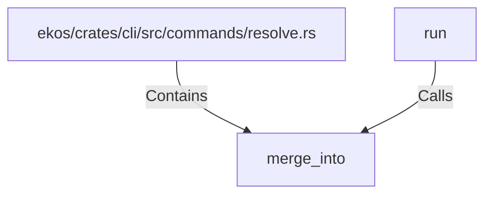

# merge_into (RustSymbol)

## Properties

| Key | Value |
|---|---|
| `kind` | function |

## Relationships

### Calls

- ← run (`e9261342-f9a3-557d-8a83-a4d1d1159682`)

### Contains

- ← ekos/crates/cli/src/commands/resolve.rs (`6b6902bf-7bb5-59f8-a210-ce0acd18d7ec`)

## Diagram

## Evidence

_No evidence cited._
