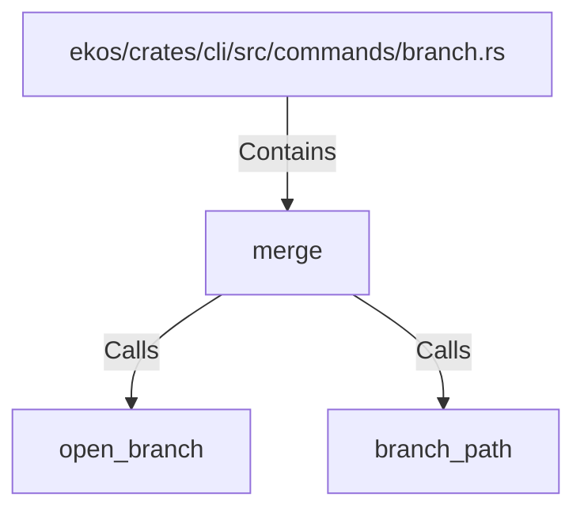

# merge (RustSymbol)

## Properties

| Key | Value |
|---|---|
| `kind` | function |

## Relationships

### Calls

- → open_branch (`bc49dd2c-e377-511c-b06c-9550959f7e15`)
- → branch_path (`9275fae1-e652-5cb3-a56c-d0e45a28067e`)

### Contains

- ← ekos/crates/cli/src/commands/branch.rs (`8ae8543c-ebb4-545a-b5fe-5735e3953e88`)

## Diagram

## Evidence

_No evidence cited._
