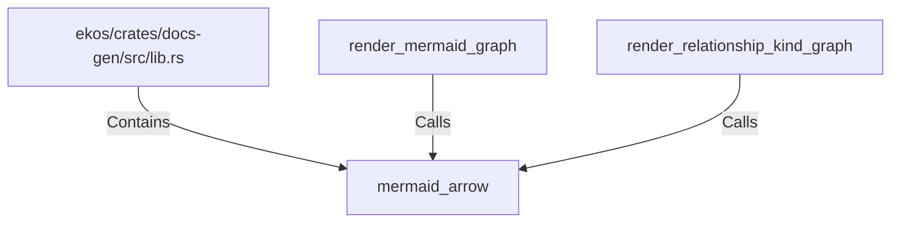

# mermaid_arrow (RustSymbol)

## Properties

| Key | Value |
|---|---|
| `kind` | function |

## Relationships

### Calls

- ← render_mermaid_graph (`35d5fb77-92f2-506e-ba73-0ffa1f0149a3`)
- ← render_relationship_kind_graph (`dd03b8f9-0881-534a-be1c-53991fa0faba`)

### Contains

- ← ekos/crates/docs-gen/src/lib.rs (`6ca4fba0-18e5-59b7-9876-7dae72e2ce0e`)

## Diagram

## Evidence

_No evidence cited._
