# migrate_to_v2 (RustSymbol)

## Properties

| Key | Value |
|---|---|
| `kind` | function |

## Relationships

### Calls

- → Ledger::all_objects_with_rowids (`f2714bfa-a29a-5e5c-b6ce-96c95bd2a1af`)
- → Codec::compress (`599e1672-3536-58b3-8cc1-736e192923ad`)
- → sibling_path (`b6f23474-e7f8-5428-991a-be47fefecb33`)
- → sig_value_to_hex (`1228fcf9-37a8-5016-b478-2f69e365f92a`)
- → Ledger::payload_to_string (`b30e2764-552e-5d3e-a1e5-34c523dd7475`)
- → id_value_to_string (`a0c3d0ec-3294-5534-a1f2-b2295cc7d77a`)
- → Ledger::entry_count (`c363719f-81ae-58c9-ac19-e0250e9268a6`)
- → Ledger::index_object_fts_v2 (`76356616-7801-5ca1-9003-e69db3599198`)
- → Ledger::create_v2 (`e0a15224-8267-58c6-9f12-b6f33a379ceb`)
- → payload_samples (`3f1868b5-8442-5a4e-bd91-87c8a3ada3f3`)
- → Ledger::object_count (`f92c42cd-96e2-5b55-8bc1-2184a7ea22d5`)
- → Ledger::open (`1202f2b1-c8ed-5a89-aac3-5ef29891cb8b`)
- → Ledger::relationship_count (`fd2750d9-0510-5e05-ac77-f3125db298a6`)
- → Codec::decompress (`3ee6589f-f3ba-5e67-b7b6-8950c0575ae5`)
- → ts_value_to_datetime (`34ebc45d-e426-5788-9f8b-c605bf91a6a3`)

### Contains

- ← ekos/crates/ledger/src/lib.rs (`21938f45-b767-5933-9e71-12e15ff53eb1`)

## Diagram

```mermaid
graph TD
    nfee5c44ca2e159dbbf5db63aff20f8c9["migrate_to_v2"]
    n21938f45b76759339e7112e15ff53eb1["ekos/crates/ledger/src/lib.rs"]
    n21938f45b76759339e7112e15ff53eb1 -->|Contains| nfee5c44ca2e159dbbf5db63aff20f8c9
    nf2714bfaa29a5e5cb6ce96c95bd2a1af["Ledger::all_objects_with_rowids"]
    nfee5c44ca2e159dbbf5db63aff20f8c9 -->|Calls| nf2714bfaa29a5e5cb6ce96c95bd2a1af
    n599e1672353658b38cc1736e192923ad["Codec::compress"]
    nfee5c44ca2e159dbbf5db63aff20f8c9 -->|Calls| n599e1672353658b38cc1736e192923ad
    nb6f23474e7f85428991abe47fefecb33["sibling_path"]
    nfee5c44ca2e159dbbf5db63aff20f8c9 -->|Calls| nb6f23474e7f85428991abe47fefecb33
    n1228fcf937a85016b4782f69e365f92a["sig_value_to_hex"]
    nfee5c44ca2e159dbbf5db63aff20f8c9 -->|Calls| n1228fcf937a85016b4782f69e365f92a
    nb30e2764552e5d3ea1e534c523dd7475["Ledger::payload_to_string"]
    nfee5c44ca2e159dbbf5db63aff20f8c9 -->|Calls| nb30e2764552e5d3ea1e534c523dd7475
    na0c3d0ec32945534a1f2b2295cc7d77a["id_value_to_string"]
    nfee5c44ca2e159dbbf5db63aff20f8c9 -->|Calls| na0c3d0ec32945534a1f2b2295cc7d77a
    nc363719f81ae58c9ac19e0250e9268a6["Ledger::entry_count"]
    nfee5c44ca2e159dbbf5db63aff20f8c9 -->|Calls| nc363719f81ae58c9ac19e0250e9268a6
    n7635661678015ca19003e69db3599198["Ledger::index_object_fts_v2"]
    nfee5c44ca2e159dbbf5db63aff20f8c9 -->|Calls| n7635661678015ca19003e69db3599198
    ne0a15224826758c69f12b6f33a379ceb["Ledger::create_v2"]
    nfee5c44ca2e159dbbf5db63aff20f8c9 -->|Calls| ne0a15224826758c69f12b6f33a379ceb
    n3f1868b584425a4ebd9187c8a3ada3f3["payload_samples"]
    nfee5c44ca2e159dbbf5db63aff20f8c9 -->|Calls| n3f1868b584425a4ebd9187c8a3ada3f3
    nf92c42cd96e25b558bc12184a7ea22d5["Ledger::object_count"]
    nfee5c44ca2e159dbbf5db63aff20f8c9 -->|Calls| nf92c42cd96e25b558bc12184a7ea22d5
    n1202f2b1c8ed5a89aac35ef29891cb8b["Ledger::open"]
    nfee5c44ca2e159dbbf5db63aff20f8c9 -->|Calls| n1202f2b1c8ed5a89aac35ef29891cb8b
    nfd2750d905105e05ac77f3125db298a6["Ledger::relationship_count"]
    nfee5c44ca2e159dbbf5db63aff20f8c9 -->|Calls| nfd2750d905105e05ac77f3125db298a6
    n3ee6589ff3ba5e67b7b68950c0575ae5["Codec::decompress"]
    nfee5c44ca2e159dbbf5db63aff20f8c9 -->|Calls| n3ee6589ff3ba5e67b7b68950c0575ae5
    n34ebc45de42657889f8bc605bf91a6a3["ts_value_to_datetime"]
    nfee5c44ca2e159dbbf5db63aff20f8c9 -->|Calls| n34ebc45de42657889f8bc605bf91a6a3
```

## Evidence

_No evidence cited._
