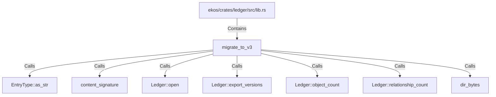

# migrate_to_v3 (RustSymbol)

## Properties

| Key | Value |
|---|---|
| `kind` | function |

## Relationships

### Calls

- → EntryType::as_str (`0beb5b76-38f4-53a2-9ee4-e1070cca9822`)
- → content_signature (`66c7da48-70e5-57fb-9882-5a5b05933963`)
- → Ledger::open (`1202f2b1-c8ed-5a89-aac3-5ef29891cb8b`)
- → Ledger::export_versions (`1ed3c4b0-eefc-5cee-8f3b-f559c0e5f97e`)
- → Ledger::object_count (`f92c42cd-96e2-5b55-8bc1-2184a7ea22d5`)
- → Ledger::relationship_count (`fd2750d9-0510-5e05-ac77-f3125db298a6`)
- → dir_bytes (`94d64c98-e745-574a-89b3-8734f99623eb`)

### Contains

- ← ekos/crates/ledger/src/lib.rs (`21938f45-b767-5933-9e71-12e15ff53eb1`)

## Diagram

## Evidence

_No evidence cited._
