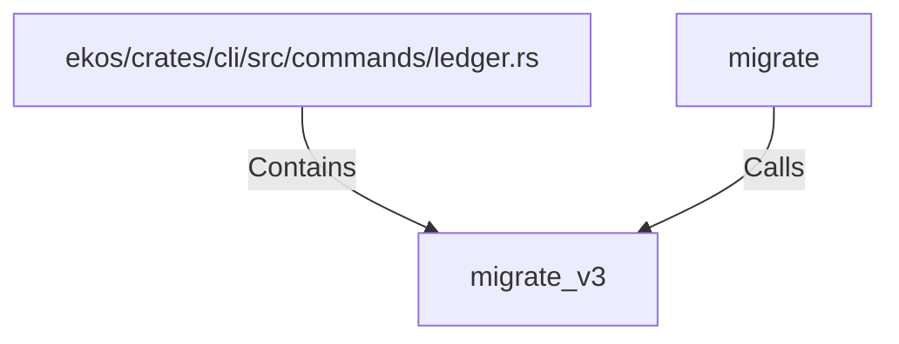

# migrate_v3 (RustSymbol)

## Properties

| Key | Value |
|---|---|
| `kind` | function |

## Relationships

### Calls

- ← migrate (`352b31b6-87e8-544f-a3a0-3f3e5136134e`)

### Contains

- ← ekos/crates/cli/src/commands/ledger.rs (`00bf5c8a-7198-5df3-a6eb-5bf22bc8ddcb`)

## Diagram

## Evidence

_No evidence cited._
