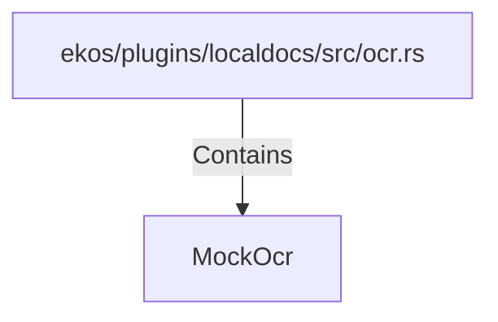

# MockOcr (RustSymbol)

## Properties

| Key | Value |
|---|---|
| `kind` | struct |

## Relationships

### Contains

- ← ekos/plugins/localdocs/src/ocr.rs (`815f45c0-f388-5213-9201-2c6958a02eba`)

## Diagram

## Evidence

_No evidence cited._
