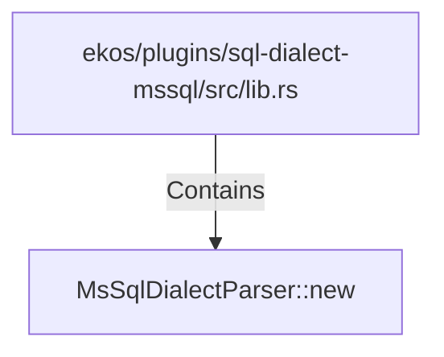

# MsSqlDialectParser::new (RustSymbol)

## Properties

| Key | Value |
|---|---|
| `kind` | method |

## Relationships

### Contains

- ← ekos/plugins/sql-dialect-mssql/src/lib.rs (`c59f040e-79f2-52ac-86f5-a2484a89b01f`)

## Diagram

## Evidence

_No evidence cited._
