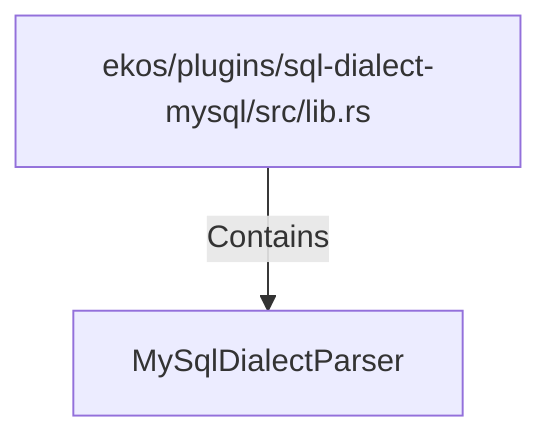

# MySqlDialectParser (RustSymbol)

## Properties

| Key | Value |
|---|---|
| `kind` | struct |

## Relationships

### Contains

- ← ekos/plugins/sql-dialect-mysql/src/lib.rs (`5d3dc4f8-6d1a-5470-8a65-53b6c2be6d34`)

## Diagram

## Evidence

_No evidence cited._
