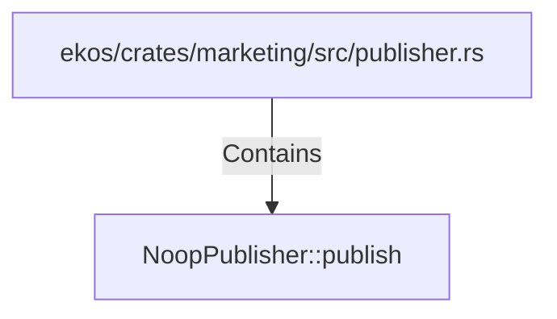

# NoopPublisher::publish (RustSymbol)

## Properties

| Key | Value |
|---|---|
| `kind` | method |

## Relationships

### Contains

- ← ekos/crates/marketing/src/publisher.rs (`3fab908f-efe6-5e1f-940b-5a16e3b7c774`)

## Diagram

## Evidence

_No evidence cited._
