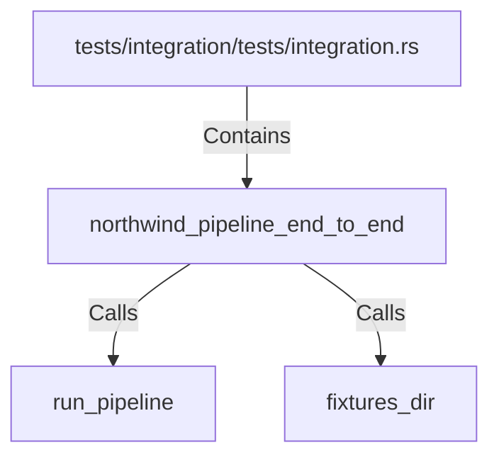

# northwind_pipeline_end_to_end (RustSymbol)

## Properties

| Key | Value |
|---|---|
| `kind` | function |

## Relationships

### Calls

- → run_pipeline (`6bb7df90-2b21-50fa-9dc1-ddde4307ef92`)
- → fixtures_dir (`5fe11438-f684-5c87-b602-8ed880979203`)

### Contains

- ← tests/integration/tests/integration.rs (`23e9eb43-c8df-52b5-a581-f2efba7085ea`)

## Diagram

## Evidence

_No evidence cited._
