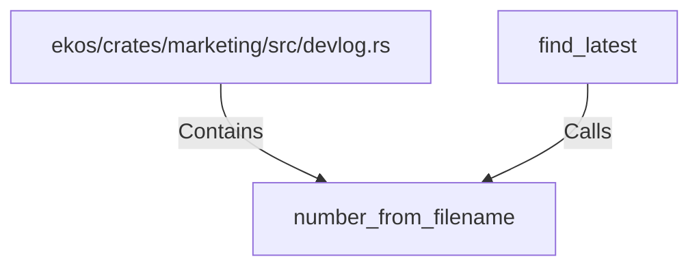

# number_from_filename (RustSymbol)

## Properties

| Key | Value |
|---|---|
| `kind` | function |

## Relationships

### Calls

- ← find_latest (`a0710c59-d9a1-5586-82bf-c77b1144ae51`)

### Contains

- ← ekos/crates/marketing/src/devlog.rs (`4ca01e5b-d21d-5312-ac99-c6aa65d7d8d0`)

## Diagram

## Evidence

_No evidence cited._
