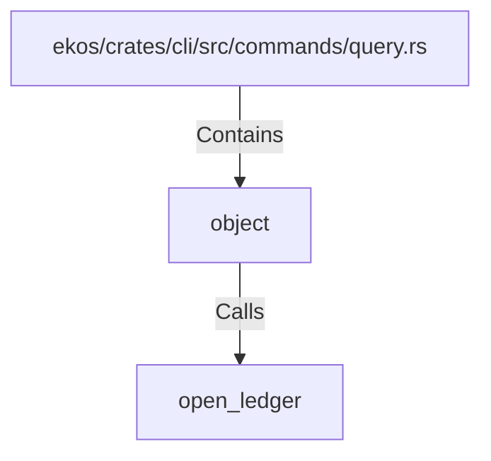

# object (RustSymbol)

## Properties

| Key | Value |
|---|---|
| `kind` | function |

## Relationships

### Calls

- → open_ledger (`fce4a499-4410-57f5-a2a6-cb2313a5b8a9`)

### Contains

- ← ekos/crates/cli/src/commands/query.rs (`76b10d14-834f-5bcb-8858-f46092b1989c`)

## Diagram

## Evidence

_No evidence cited._
