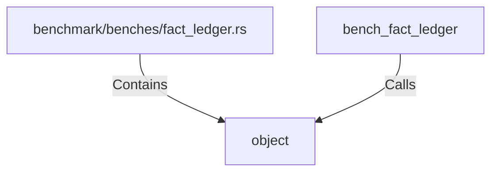

# object (RustSymbol)

## Properties

| Key | Value |
|---|---|
| `kind` | function |

## Relationships

### Calls

- ← bench_fact_ledger (`ea6cfbce-3603-5bd4-a3a6-2c71a5948e9a`)

### Contains

- ← benchmark/benches/fact_ledger.rs (`51ded36f-c9b2-5f8a-97c1-43fa4d7a63a1`)

## Diagram

## Evidence

_No evidence cited._
