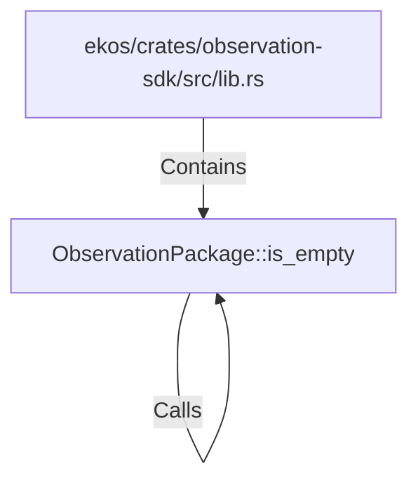

# ObservationPackage::is_empty (RustSymbol)

## Properties

| Key | Value |
|---|---|
| `kind` | method |

## Relationships

### Calls

- → ObservationPackage::is_empty (`c64247bb-7cbc-57b1-974d-10145b2b6ebf`)

### Contains

- ← ekos/crates/observation-sdk/src/lib.rs (`66ce958b-7250-5ec2-954e-eacf8f64aae0`)

## Diagram

## Evidence

_No evidence cited._
