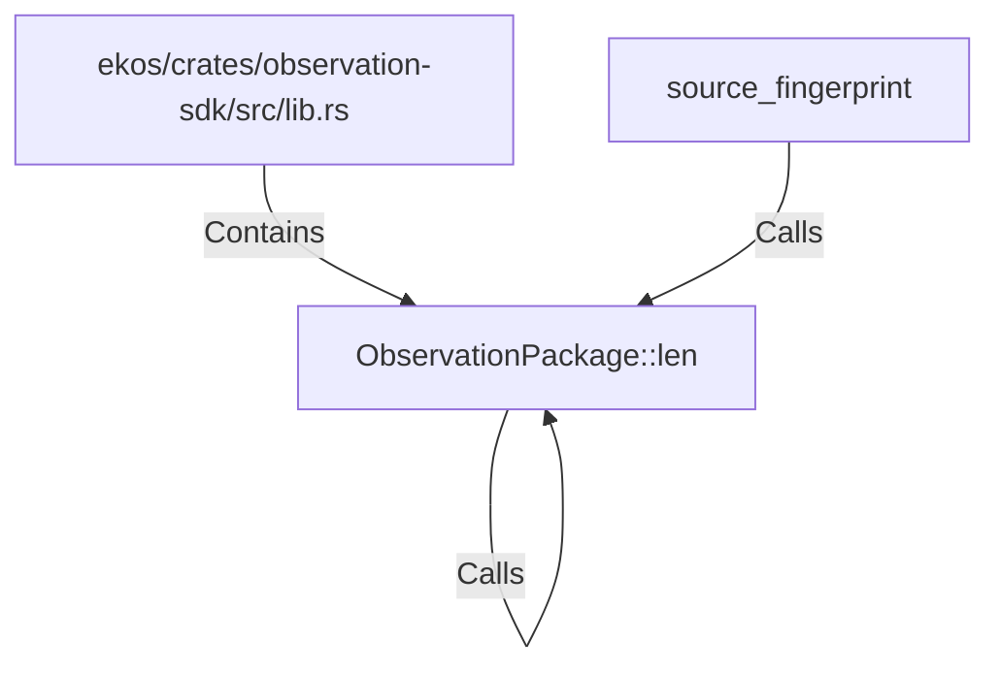

# ObservationPackage::len (RustSymbol)

## Properties

| Key | Value |
|---|---|
| `kind` | method |

## Relationships

### Calls

- ← source_fingerprint (`ec52b091-354f-563d-9072-03c8ef3092bf`)
- → ObservationPackage::len (`b4e4cbd9-d9f3-5d02-a4dc-0c11bdbedc05`)

### Contains

- ← ekos/crates/observation-sdk/src/lib.rs (`66ce958b-7250-5ec2-954e-eacf8f64aae0`)

## Diagram

## Evidence

_No evidence cited._
