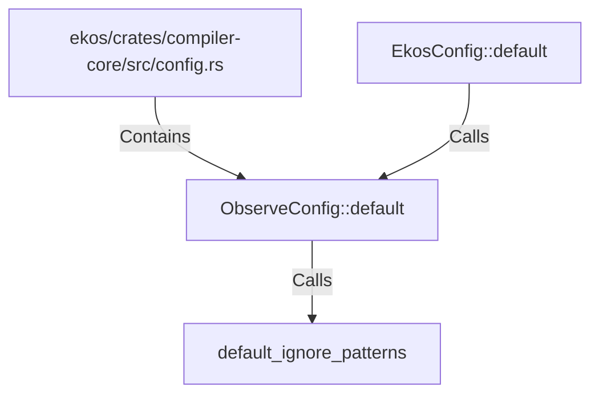

# ObserveConfig::default (RustSymbol)

## Properties

| Key | Value |
|---|---|
| `kind` | method |

## Relationships

### Calls

- → default_ignore_patterns (`8365dc18-7a68-5b6c-bb0b-fcddf13ef488`)
- ← EkosConfig::default (`96f3be94-9761-5db0-b99a-0c705c9c55d0`)

### Contains

- ← ekos/crates/compiler-core/src/config.rs (`d0747f34-25e1-5426-80eb-a54fffcac598`)

## Diagram

## Evidence

_No evidence cited._
