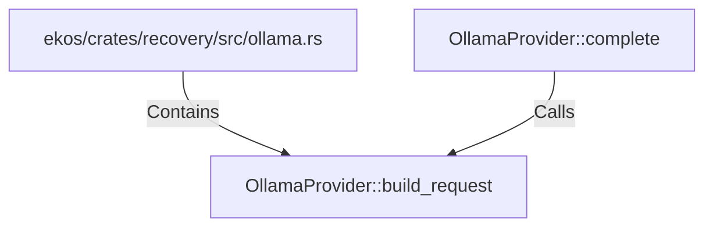

# OllamaProvider::build_request (RustSymbol)

## Properties

| Key | Value |
|---|---|
| `kind` | method |

## Relationships

### Calls

- ← OllamaProvider::complete (`ef3a52c3-c8e3-51fb-bd3d-82f0de4e0d55`)

### Contains

- ← ekos/crates/recovery/src/ollama.rs (`952b3eaf-406f-5c22-b538-f5c2d5fbe2f9`)

## Diagram

## Evidence

_No evidence cited._
