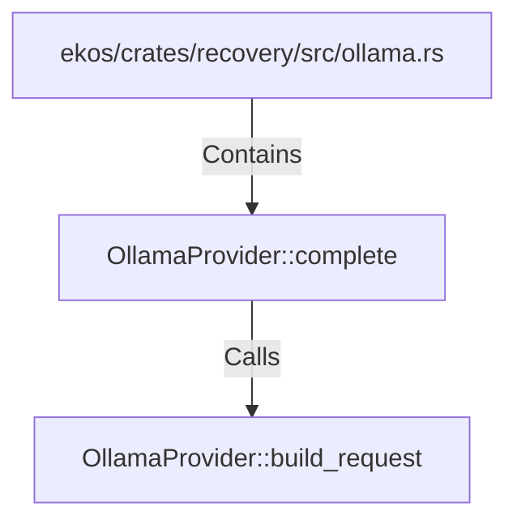

# OllamaProvider::complete (RustSymbol)

## Properties

| Key | Value |
|---|---|
| `kind` | method |

## Relationships

### Calls

- → OllamaProvider::build_request (`41f54355-2110-5c70-92a8-e30c2be20b24`)

### Contains

- ← ekos/crates/recovery/src/ollama.rs (`952b3eaf-406f-5c22-b538-f5c2d5fbe2f9`)

## Diagram

## Evidence

_No evidence cited._
