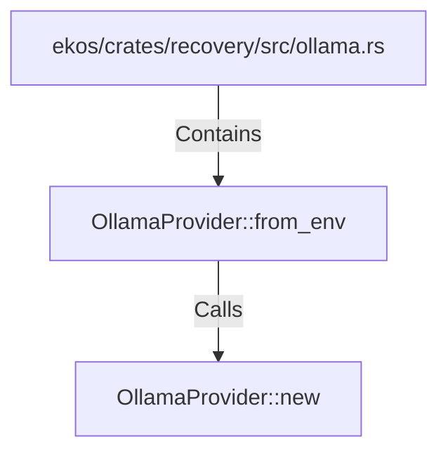

# OllamaProvider::from_env (RustSymbol)

## Properties

| Key | Value |
|---|---|
| `kind` | method |

## Relationships

### Calls

- → OllamaProvider::new (`0c0d72bf-c838-592c-9df9-efa881b7ae52`)

### Contains

- ← ekos/crates/recovery/src/ollama.rs (`952b3eaf-406f-5c22-b538-f5c2d5fbe2f9`)

## Diagram

## Evidence

_No evidence cited._
