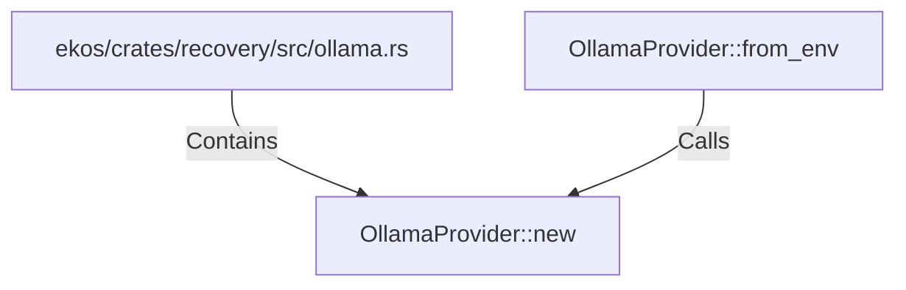

# OllamaProvider::new (RustSymbol)

## Properties

| Key | Value |
|---|---|
| `kind` | method |

## Relationships

### Calls

- ← OllamaProvider::from_env (`7cec6ac7-9808-51cb-bcc8-ba04214c5e84`)

### Contains

- ← ekos/crates/recovery/src/ollama.rs (`952b3eaf-406f-5c22-b538-f5c2d5fbe2f9`)

## Diagram

## Evidence

_No evidence cited._
