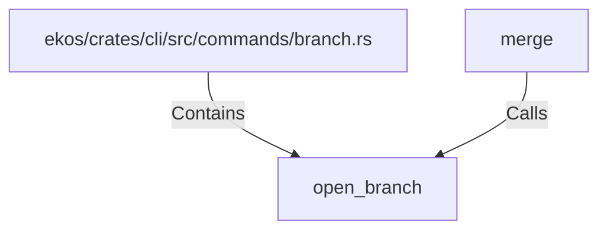

# open_branch (RustSymbol)

## Properties

| Key | Value |
|---|---|
| `kind` | function |

## Relationships

### Calls

- ← merge (`419d1f8f-21a4-549e-9c0f-d83a9c18265c`)

### Contains

- ← ekos/crates/cli/src/commands/branch.rs (`8ae8543c-ebb4-545a-b5fe-5735e3953e88`)

## Diagram

## Evidence

_No evidence cited._
