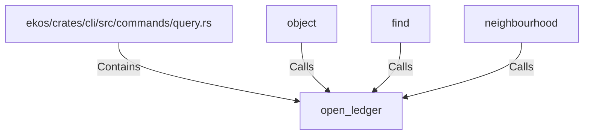

# open_ledger (RustSymbol)

## Properties

| Key | Value |
|---|---|
| `kind` | function |

## Relationships

### Calls

- ← object (`b6e1ea7f-aebd-56bc-a79e-36c75bad4b97`)
- ← find (`9ae5ed64-d6e6-597d-9bfc-0db3de66d004`)
- ← neighbourhood (`62eadfcc-5931-5f83-b1dc-841406bcf8ae`)

### Contains

- ← ekos/crates/cli/src/commands/query.rs (`76b10d14-834f-5bcb-8858-f46092b1989c`)

## Diagram

## Evidence

_No evidence cited._
