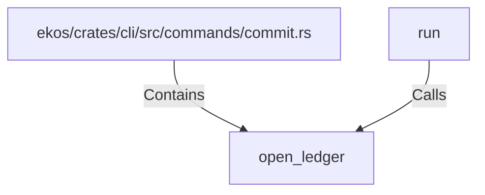

# open_ledger (RustSymbol)

## Properties

| Key | Value |
|---|---|
| `kind` | function |

## Relationships

### Calls

- ← run (`5eff14dd-0262-599c-9988-3daeffd5ed67`)

### Contains

- ← ekos/crates/cli/src/commands/commit.rs (`f48ae11b-a9a7-54f0-8cc6-a192b1641436`)

## Diagram

## Evidence

_No evidence cited._
