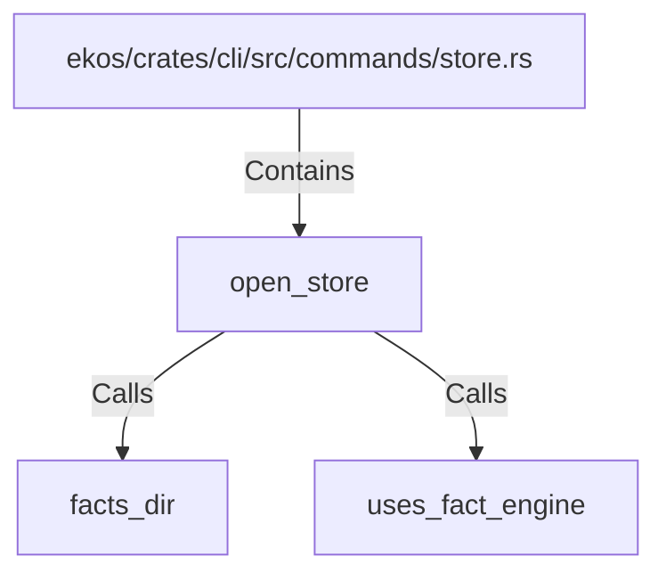

# open_store (RustSymbol)

## Properties

| Key | Value |
|---|---|
| `kind` | function |

## Relationships

### Calls

- → facts_dir (`83873731-f148-5047-ad68-b92b7feef390`)
- → uses_fact_engine (`10d67e5a-c754-5199-915e-23349038a6f5`)

### Contains

- ← ekos/crates/cli/src/commands/store.rs (`ce2ed217-2b42-5760-9d2e-e2ca1574a517`)

## Diagram

## Evidence

_No evidence cited._
