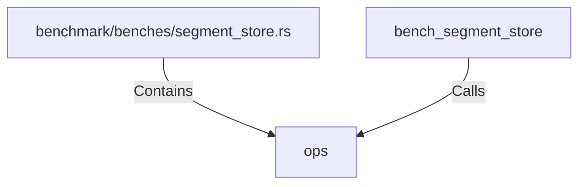

# ops (RustSymbol)

## Properties

| Key | Value |
|---|---|
| `kind` | function |

## Relationships

### Calls

- ← bench_segment_store (`c381c550-3078-5537-b07a-9d27afe2f58b`)

### Contains

- ← benchmark/benches/segment_store.rs (`d038c7b7-05b2-5c5c-8f62-c4ea6f2529ee`)

## Diagram

## Evidence

_No evidence cited._
