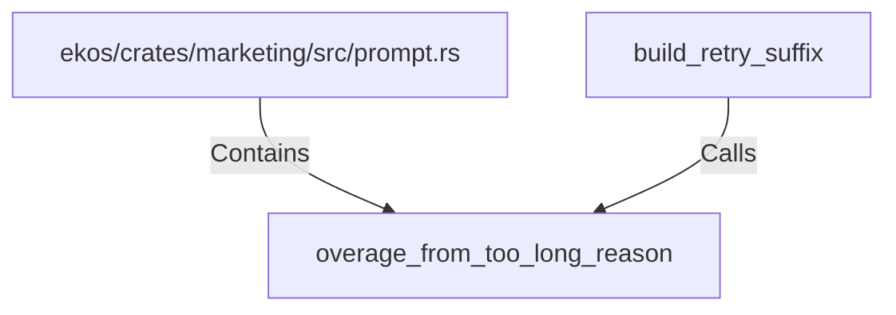

# overage_from_too_long_reason (RustSymbol)

## Properties

| Key | Value |
|---|---|
| `kind` | function |

## Relationships

### Calls

- ← build_retry_suffix (`273489b9-131a-5671-ae8b-4ffa18a02188`)

### Contains

- ← ekos/crates/marketing/src/prompt.rs (`49e3daf4-be3b-5889-a66e-372e8980f187`)

## Diagram

## Evidence

_No evidence cited._
