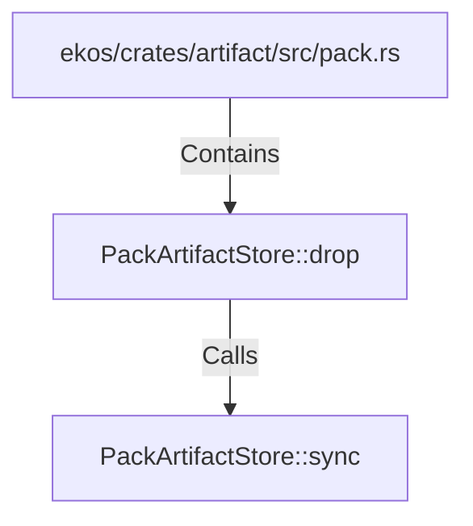

# PackArtifactStore::drop (RustSymbol)

## Properties

| Key | Value |
|---|---|
| `kind` | method |

## Relationships

### Calls

- → PackArtifactStore::sync (`df1c1ef5-b760-5b80-a4bd-17b6354cf81b`)

### Contains

- ← ekos/crates/artifact/src/pack.rs (`98cd7507-d9e7-59e3-acfb-c7ffb05d9f73`)

## Diagram

## Evidence

_No evidence cited._
