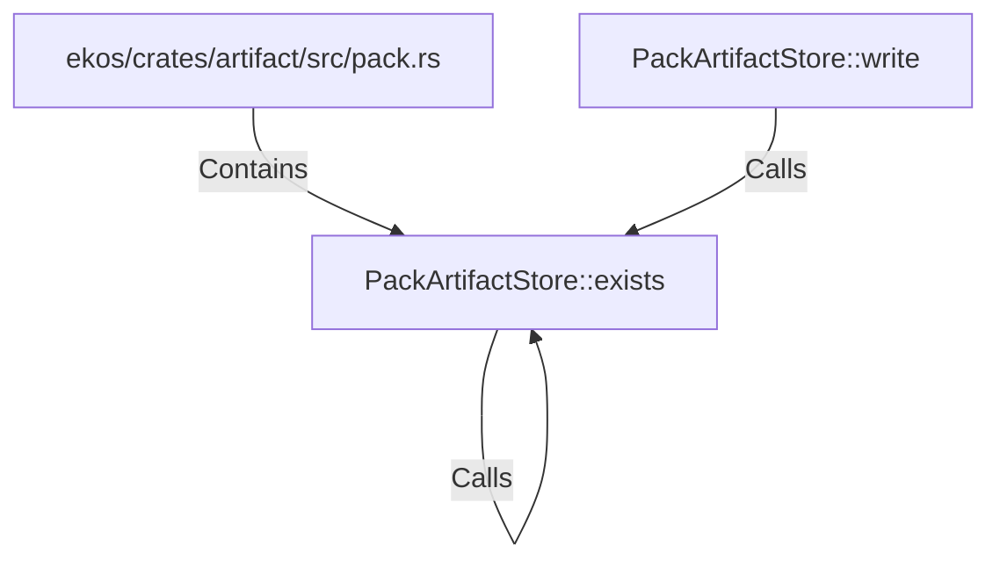

# PackArtifactStore::exists (RustSymbol)

## Properties

| Key | Value |
|---|---|
| `kind` | method |

## Relationships

### Calls

- ← PackArtifactStore::write (`f153ee62-96d1-5be6-bdb9-249eab66c33b`)
- → PackArtifactStore::exists (`a58cd217-2bcf-5516-83b6-1a7b8db7f75e`)

### Contains

- ← ekos/crates/artifact/src/pack.rs (`98cd7507-d9e7-59e3-acfb-c7ffb05d9f73`)

## Diagram

## Evidence

_No evidence cited._
