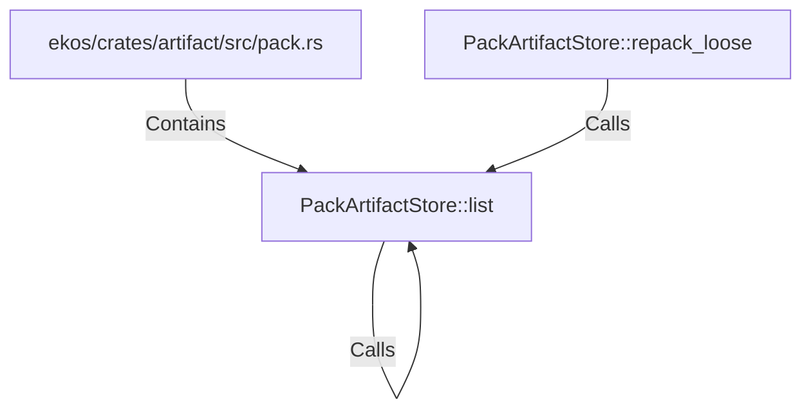

# PackArtifactStore::list (RustSymbol)

## Properties

| Key | Value |
|---|---|
| `kind` | method |

## Relationships

### Calls

- ← PackArtifactStore::repack_loose (`a9bd0f7a-c0de-5f6f-8504-6946351fd959`)
- → PackArtifactStore::list (`fefadbb6-d1c4-5a6e-8f67-72b562790708`)

### Contains

- ← ekos/crates/artifact/src/pack.rs (`98cd7507-d9e7-59e3-acfb-c7ffb05d9f73`)

## Diagram

## Evidence

_No evidence cited._
