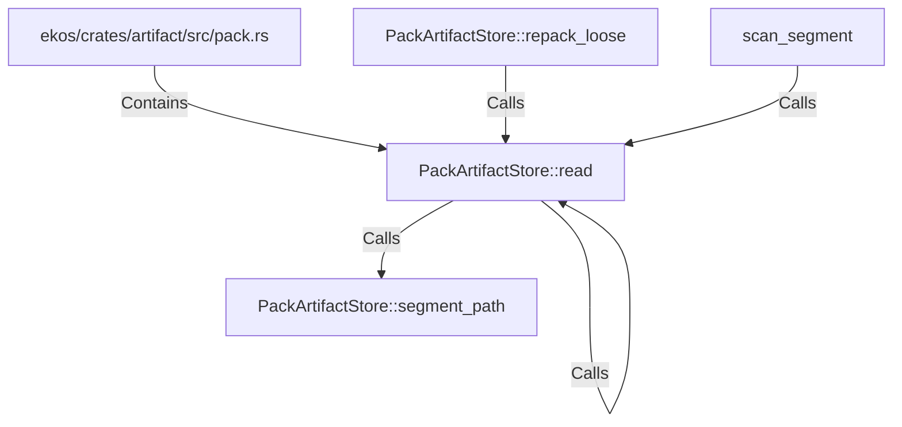

# PackArtifactStore::read (RustSymbol)

## Properties

| Key | Value |
|---|---|
| `kind` | method |

## Relationships

### Calls

- ← PackArtifactStore::repack_loose (`a9bd0f7a-c0de-5f6f-8504-6946351fd959`)
- → PackArtifactStore::segment_path (`81f9c174-cef7-5857-bc30-9e1cdef8c67a`)
- → PackArtifactStore::read (`a5061f98-e89d-569e-a13c-cca36a9e7f0a`)
- ← scan_segment (`c4b5e70f-e265-5b5b-9fa4-a7aed1ea48cf`)

### Contains

- ← ekos/crates/artifact/src/pack.rs (`98cd7507-d9e7-59e3-acfb-c7ffb05d9f73`)

## Diagram

## Evidence

_No evidence cited._
